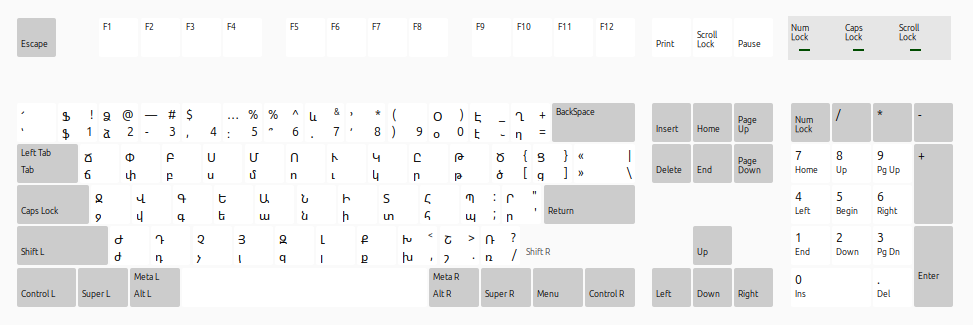

# Custom Armenian Keyboard Layout Linux

I've edited the Armenian ՄՈՒԿԸ/ԱՆԻ keyboard layout on Linux by adding all the missing symbols from the QWERTY layout. I modified the `/usr/share/X11/xkb/symbols/am` file.

Now I can type the word "ինչ-որ" without switching the keyboard.
\>:3
