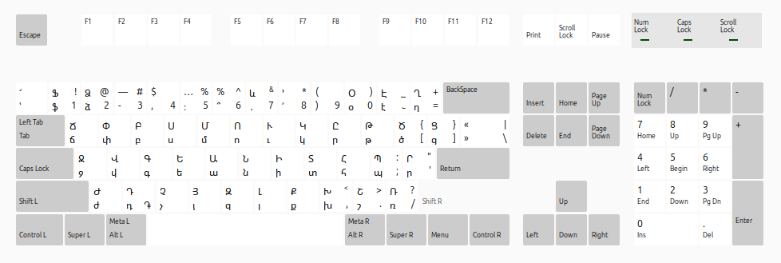
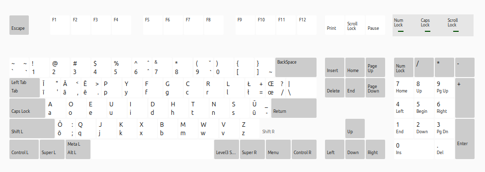

# Heghine's Custom Layouts for Linux :3

This repository contains all Heghine's official custom keyboard layouts that I've created or modified for Linux with the Ubuntu distribution. I modified the files in the `/usr/share/X11/xkb/symbols/` directory on Linux. If you want to use the same layouts just replace the files from the `/usr/share/X11/xkb/symbols/` directory with the ones from this repository.

## ⚠️ Warning

> You're editing the system files of Linux! You should replace the files exactly with the same names as the ones in this repository. If you don't, you might break something. You can also make a backup of the original files before editing them. I'm also not sure if keyboard files are same in other distributions. Check it first.

## Armenian ՄՈՒԿԸ/ԱՆԻ

I've edited the Armenian ՄՈՒԿԸ/ԱՆԻ keyboard layout on Linux by adding all the missing symbols from the QWERTY layout plus em dash and em dash, and add the dram sign on the Դ letter when you hold the Alt key.



Now I can type the word "ինչ-որ" without switching the keyboard.
\>:3

## Russian (Typewriter)

I've edited the Russian (Typewriter) keyboard layout on Linux by adding the ruble sign on the Р letter when you hold the Alt key. And em dash and em dash in the 2 key.


Types "ruble"! Bohahahaha!
:3

## English (Rixēspēk)

To add a Rixēspēk keyboard layout edit the `/usr/share/X11/xkb/symbols/us` file.



```xkb
partial alphanumeric_keys
xkb_symbols "dvorak_rixe" {

    include "us(dvorak)"

    name[Group1]= "English (Dvorak, Rixēspēk)";

    key <AD01> { [ U012B, U012A, apostrophe,    quotedbl ] }; // ī Ī
    key <AD02> {[ U0101, U0100,     comma,    less ]}; // ā Ā
    key <AD03> {[ U0113, U0112,  period,    greater ]}; // ē Ē
    key <AB01> { [ U014D, U014C, semicolon,    colon ] }; // ō Ō
    key <AC11> { [ U016B, U016A, minus,       underscore ] }; // ū Ū
    key <AD11> { [ U0142, U0141, slash,    question ] }; // ł Ł
    key <AD12> { [ U0153, U0152, equal,    plus ]}; // œ Œ

    include "level3(ralt_switch)"
};
```

Now edit the `/usr/share/X11/xkb/rules/evdev.xml` file. Add a new variant to the `us` layout.

```xml
<layout>
  <configItem>
    <name>us</name>
    ...
  </configItem>

  <variantList>

    ... existing variants ...

    <variant>
      <configItem>
        <name>dvorak_rixe</name>
        <description>Dvorak (Rixēspēk)</description>
      </configItem>
    </variant>

  </variantList>
</layout>
```

Rebuild the cache.

```bash
sudo rm -rf /var/lib/xkb/*
sudo dpkg-reconfigure xkb-data
```

Now you can switch to the Rixēspēk keyboard layout.

```bash
setxkbmap us dvorak_rixe
```

Display the keyboard layout.

```bash
gkbd-keyboard-display -l dvorak_rixe
```

## Fixes

If you broke something just reinstall the `xkb-data` package.

```bash
sudo apt reinstall xkb-data
```

Now clear the cache:

```bash
sudo rm -rf /var/lib/xkb/*
```

And reboot.

```bash
sudo reboot
```
